# Multinational-Retail-Data-Centralisation

<h1> Retail Data Centralization / Data Extraction </h1>

# Table of Contents

1. [Description](#description)
2. [Setting up the data base ](#Setting-up-the-data-base)
3. [Installation](#installation)
4. [Project Code Breakdown](Project-Code-Breakdown)
5. [Usage](#usage)
6. [SQL Data cleaning in pgAdmin4](#SQL-Data-cleaning-in-pgAdmin4)
7. [SQL Data Quieres in pgAdmin4](#SQL-Data-Quieres-in-pgAdmin4)
8. [File Structure](#file-structure)
9. [License](#license)

## Description

The Retail Data Centralisation/Data Extraction project aims to centralise and streamline the extraction of retail data from various sources. It provides a robust system to gather data from multiple retail outlets, analyse it, and present insights for informed decision-making. The primary objectives include:

Developing an efficient data extraction mechanism from diverse retail systems.
Centralising data to a unified database or data warehouse for easy access and analysis.
Implementing tools for data cleansing, transformation, and quieris.
Enabling stakeholders to derive actionable insights for strategic decision-making.
Throughout the project, several key learnings were attained, including data integration techniques, ETL (Extract, Transform, Load) processes, database management, data cleaning SQL and Python. Understanding retail-specific data challenges and developing scalable solutions were integral parts of the learning process.

## Setting up the data base 
Install PostgreSQL16
Install pgAdmin 4 
Set up a new database within pgadmin4 and name it Sales_data.
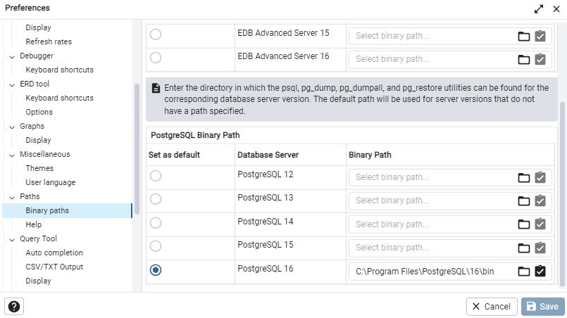
Ensure pgAdmin 4 has the correct binary path PostgreSQL16 

## Installation
To install and set up the Retail Data Centralization/Data 
Extraction project, follow these steps:

Clone the repository:

git clone https://github.com/qloutin22/Multinational-Retail-Data-Centralisation

## Install dependencies:

Navigate to the project directory and install necessary dependencies.

pip install -r requirements.txt
import tabula as ta
import pandas as pd
import yaml
from yaml.loader import SafeLoader
from sqlalchemy import create_engine,MetaData,Table
from database_utils import DatabaseConnector as dc
import requests
import boto3
from io import StringIO
import re
import yaml
import numpy as np

## Usage

To utilize the Retail Data Centralization/Data Extraction project effectively, follow these guidelines:

Data Extraction:

Run the extraction scripts to collect data from retail sources.
Ensure the data extraction process runs smoothly and data is ingested into the system.

Data Centralization:

Verify that extracted data is centralized into the designated pgAdmin4 PostgreSQL16 database .
The database should have the following structure and have the following tables.
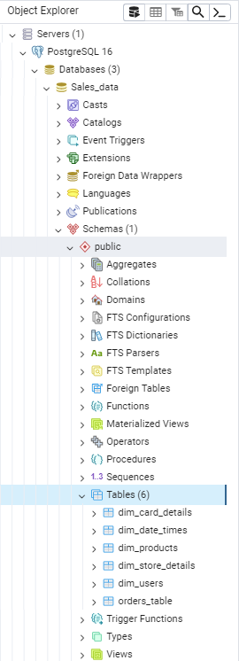

## Project Code Breakdown

<h4>gitignore</h4>
Hides database crediental files.
<h4>data_cleaning.py</h4>
This file contains the Data Cleaning class which cleans data. The data was also cleaned in SQL.
<h5>def read_rds_table</h5>
Reads tables and returns a table name.
<h5>def clean_orders_data</h5>
Cleans data from a table name that was identifed using the above method. The data is cleaned into different data types.
<h5>upload_to_db_2</h5>
This method contains a engine to upload tables to a pgAdmin4 database.
<h5>def upload_to_json</h5>
This method gets a json file from a url and returns the data.
<h5>def upload_to_db_3</h5>
This method takes the json file from the above method and uploads it to a table using an engine created in another method.
<h4>data_extraction.py</h4>
This file contains various data extraction and data cleaning methods
<h5>def retrieve_pdf_data</h5>
This method gets data from a PDF link and returns the data.
<h5>clean_card_data</h5>
This method cleans the extracted PDF data from the method above.
<h5>def upload_to_de</h5>
This method contains a data base engine which uploads the PDF data to pgAdmin4
<h5> def retrieve_store_data</h5>
This method uses an API to extract data. It uses a x-api-key to access the data. This method contains a for loop which which genrates different links dependent on store number.
<h5> def called_clean_store_data</h5>
This method cleans the data extracted from the method above. 
<h5> def upload_to_db</h5>
This method uploads data to a pgAdmin4 data base.
<h5> def upload_db_engine</h5>
This method created a engine which is used to upload data to pgAdmin4.
<h5> def extract_from_s3</h5>
This method extract data from an Amazon S3 (Simple Storage Service) bucket and returns the data as pandas data frame.
<h5>def convert_product_weights</h5>
This method cleans data. It converts data dependant on the unit of measure.
<h5>def clean_user_data</h5>
This method cleans the data extracted from the method above.
<h5>def upload_to_db_2</h5>
This method uploads the extracted data into a table in pg Admin4 using a search engine detailed in another method.
<h4>database_utils.py</h4>
This file contains the database connector class.
<h5>def read_db_creds</h5>
This method prints the database credentials.
<h5>def init_db_engines</h5>
This method return the search engine.
<h5>def list_db_tables</h5>
This method prints a list of all tables.
<h5>def clean_user_data</h5>
This method cleans user data to different data types.
<h5>def upload_to_db</h5>
This method uploads data to a specified table using in a pgAdmin4 database. 
<h5>def upload_db_engine</h5>
This method contains the details of the engine used to upload data to pgAdmin4 database.
<h4>db_creds.yaml</h4>
This file contains database credentials.
<h4>de_creds.yaml</h4>
This file contains database credentials.
<h4>upload_creds.yaml</h4>
This file contains upload credentials.

## SQL Data Cleaning in pgAdmin4

I used SQL to clean some of my user data once in pgAdmin 4.
SQL code used to transform data types in pgAdmin4
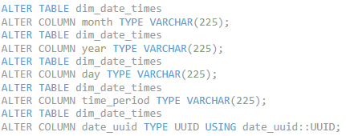
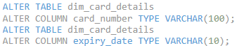
SQL code used to records with 'date_uuid' values that do not match the UUID format
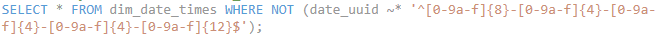
SQL code used to update invalid 'date_uuid' values to NULL
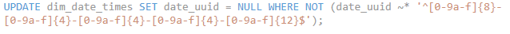
SQL code used to change Change the data type of 'date_payment_confirmed' to DATE
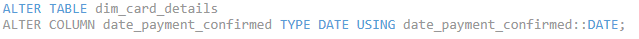
SQL code used to Change data types of columns to the required types and Update 'NULL' strings in 'date_payment_confirmed' column to actual NULL values

Code used to Change the data type of 'date_payment_confirmed' to DATE
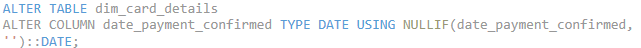
Code used to Alter tables and add primary keys
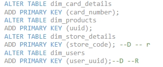
Null values from dim_date_times had to be viewed and removed 
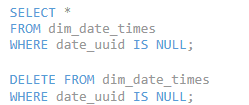
The following code is uded to a unquie keys , key constraints and forgein keys.
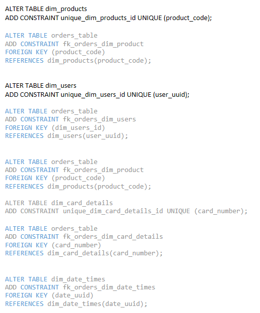
Onece everything is added your pgAdmin4 database dim tables should look like this :
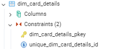
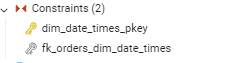
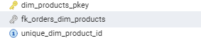
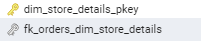
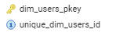
and the orders tables should contain these keys. This will be used to join the data for quieries.
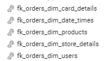
## SQL Data Quieres in pgAdmin4

I ran SQL quieries in VS code

What Locations have the most stores?
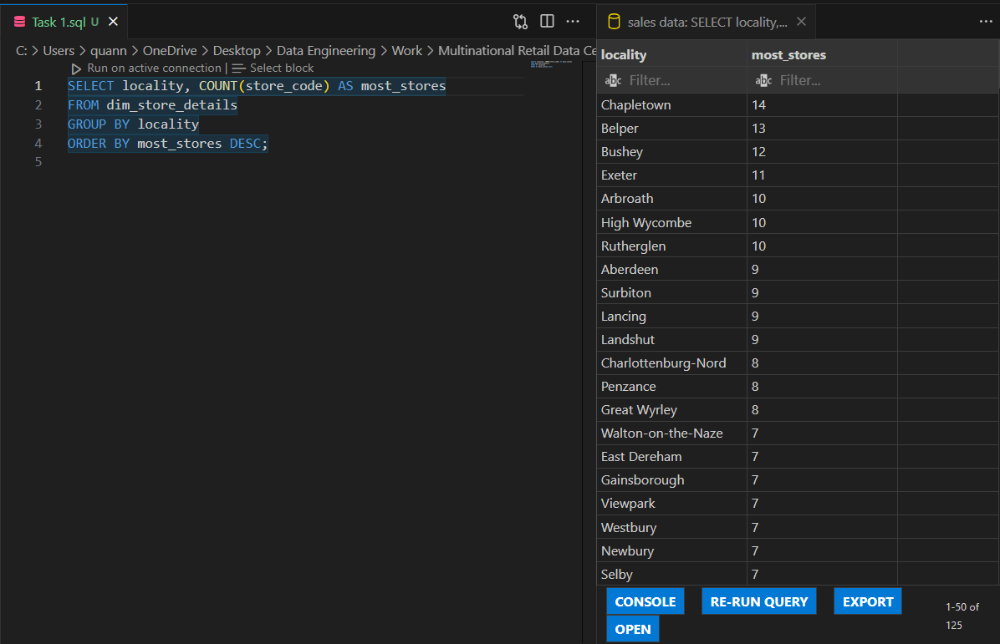
What month produced the largest amounts of sales?
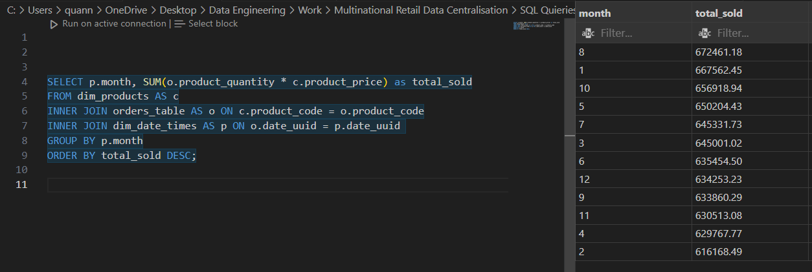
What total and percentage of sales coming from each of the different store types?
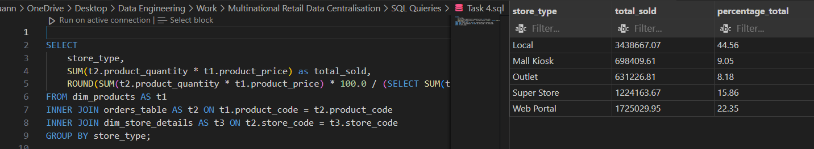
Determine which type of store is generating the most sales in Germany
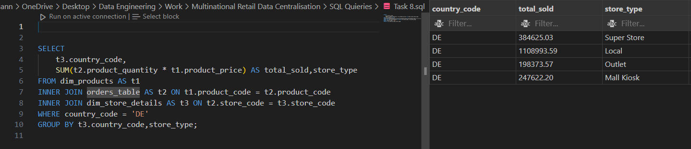

 Perform a query to determine the staff numbers in each of the countries the company sells in.
I used this updates strings and add new colums 
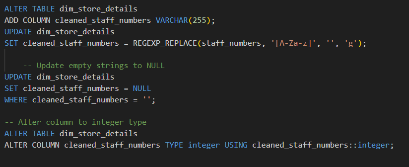
I used this code to left join my table 
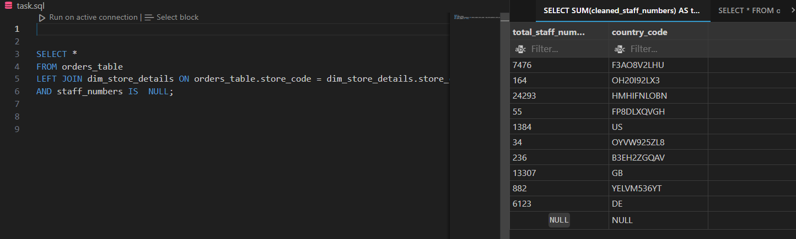
Filtered by desired country code.
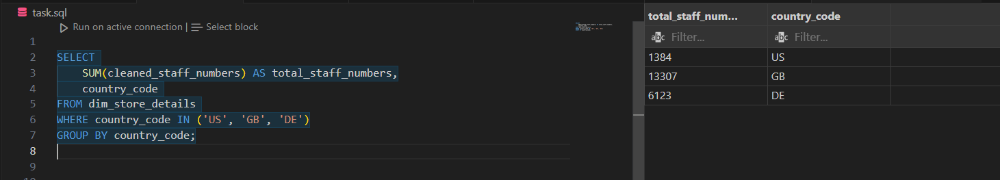

## File Structure
The project's file structure is organized as follows:
retail-data-centralization/
│
├── data_cleaning.py
│
├── data_extraction.py
│
├── data_utils.py
│ 
├── visualization/
│
├── db_creds.yaml
|
|──de_creds.yaml
|
|──License.md
|
|──README.md
|
|──upload_creds.yaml

## License
This project is licensed under the MIT License - see the LICENSE file for details.